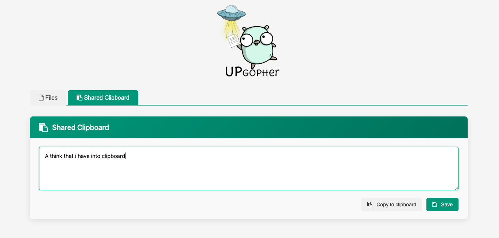

# Upgopher

<p align="center"></p>

[](https://github.com/wanetty/upgopher/actions/workflows/go.yml)

This is a simple Go web server that allows users to upload files and view a list of the uploaded files. The server can be run locally or deployed to a remote server.

This project tries to replace all file servers that use python, since there are always problems with libraries. Sometimes we want it to be on a remote pc and go gives you the possibility of cross-platform compilation and to work anywhere...




## Features
* Users can upload files by selecting a file and clicking the "Upload" button
* Uploaded files are stored in the "uploads" directory by default, but the directory can be changed using the -dir flag
* Users can view a list of the uploaded files by visiting the root URL
* Basic authentication is available to restrict access to the server. To use it, set the -user and -pass flags with the desired username and password.
* Traffic via HTTPS with self-signed certificate generation or custom certificates
* Browse through folders and upload files with drag-and-drop support
* Copy file URLs to clipboard with one click for easy sharing
* Search within text files directly from the web interface
* Create custom path aliases for easy file access
* Shared clipboard for cross-device text sharing
* Zip folder download functionality
* Option to hide hidden files with the -disable-hidden-files flag

### Security Features
* **Path Traversal Protection**: Validates all file paths to prevent directory escape attacks
* **Directory Deletion Prevention**: Blocks attempts to delete directories via the delete endpoint
* **Rate Limiting**: Clipboard endpoint limited to 20 requests per minute per IP to prevent abuse
* **Concurrent Access Protection**: Thread-safe custom paths management with mutex protection
* **HTTP Timeouts**: Server configured with 60s read/write timeouts and 120s idle timeout to prevent resource exhaustion
* **Sanitized Error Messages**: Filesystem paths hidden in HTTP responses to prevent information leakage
* **Constant-Time Authentication**: Basic auth uses constant-time comparison to prevent timing attacks

## Installation


### Automatically

Just run this command in your terminal with go installed.
```bash
go install github.com/wanetty/upgopher@latest
```

### Releases

Go to the [releases](https://github.com/wanetty/upgopher/releases) section and get the one you need.

### Manual

Just build it yourself

```bash
git clone https://github.com/wanetty/upgopher.git
cd upgopher
go build 
```
### Docker

```bash
docker build . -t upgopher
docker run --name upgopher -p 9090:9090  upgopher
```

## Usage

### Help Output:

```bash
./upgopher -h
Usage of ./upgopher:
  -cert string
        HTTPS certificate
  -dir string
        directory path (default "./uploads")
  -disable-hidden-files
        disable showing hidden files
  -key string
        private key for HTTPS
  -pass string
        password for authentication
  -port int
        port number (default 9090)
  -q    quite mode
  -ssl
        use HTTPS on port 443 by default. (If you don't put cert and key, it will generate a self-signed certificate)
  -user string
```

### Examples

**Basic usage:**
```bash
./upgopher
```
This will start the server on the default port (9090) and store uploaded files in the ./uploads directory.

**Custom port and directory:**
```bash
./upgopher -port 8080 -dir "/path/to/files"
```

**With basic authentication:**
```bash
./upgopher -user admin -pass secretpassword
```

**With HTTPS (self-signed certificate):**
```bash
./upgopher -ssl
```

**With HTTPS (custom certificate):**
```bash
./upgopher -ssl -cert /path/to/cert.pem -key /path/to/key.pem
```

**Hide hidden files:**
```bash
./upgopher -disable-hidden-files
```

## Testing

The project includes comprehensive test coverage for security-critical functions and handlers.

### Running Tests

Run all tests:
```bash
go test -v ./...
```

Run only unit tests:
```bash
go test -v -run 'Test(IsSafePath|SearchInFile|Base64|CheckRateLimit|FormatFileSize)'
```

Run security tests:
```bash
go test -v -run 'Test(Path|Directory|RateLimiting|CustomPaths|RawHandler|SearchHandler|BasicAuth)'
```

### Test Coverage

The test suite includes:
- **Unit Tests** (`upgopher_test.go`): Core functionality testing
  - Path traversal prevention (`isSafePath`)
  - File search functionality with case-sensitive and whole-word options
  - Base64 path encoding/decoding
  - Rate limiting logic
  - File size formatting

- **Security Tests** (`security_test.go`): Attack vector validation
  - 6 different path traversal attack techniques
  - Directory deletion prevention
  - Rate limiting under load
  - Concurrent custom paths access (race condition prevention)
  - Raw file handler security
  - Search handler path injection prevention
  - Authentication bypass attempts

### Coverage Goals
- **Critical Security Functions**: 100% coverage
- **Overall Project**: 60%+ coverage target
- All tests passing on main and security branches

## Security

### Reporting Vulnerabilities

If you discover a security vulnerability, please contact [@gm_eduard](https://twitter.com/gm_eduard/) directly. Please do not open a public issue.

### Security Best Practices

When deploying Upgopher:
1. **Always use HTTPS** in production (`-ssl` flag)
2. **Enable authentication** for public-facing deployments (`-user` and `-pass` flags)
3. **Restrict directory access** using `-dir` to limit filesystem exposure
4. **Keep the binary updated** to get the latest security patches
5. **Monitor logs** for suspicious access patterns (unless using `-q` quiet mode)
6. **Use firewall rules** to restrict access to trusted IPs when possible

### Threat Model

Upgopher is designed for:
- ✅ Trusted local networks (home LANs, office networks)
- ✅ Single-user or small team file sharing
- ✅ Development and testing environments

Upgopher is **NOT recommended** for:
- ❌ Public internet exposure without additional security layers (reverse proxy, VPN)
- ❌ Multi-tenant environments with strict access control requirements
- ❌ Hosting untrusted user uploads without additional scanning/validation

### Recent Security Improvements (v1.11.0)

- Fixed race condition in custom paths map (SEC-1)
- Added rate limiting for clipboard endpoint (SEC-3)
- Prevented directory deletion via delete endpoint (SEC-4)
- Sanitized filesystem paths in error messages (SEC-6)
- Added HTTP server timeouts to prevent resource exhaustion
- Comprehensive security test suite with attack vector validation

## License
This project is licensed under the MIT License. See the LICENSE file for details.

## Development

### Building from Source

```bash
git clone https://github.com/wanetty/upgopher.git
cd upgopher
go build -o upgopher
```

### Running Tests

```bash
# All tests
go test -v ./...

# Only fast tests (skip time-based tests)
go test -v -short ./...

# With coverage
go test -cover ./...
```

### Contributing

1. Fork the repository
2. Create a feature branch (`git checkout -b feature/amazing-feature`)
3. Make your changes
4. Run tests (`go test -v ./...`)
5. Commit your changes (`git commit -m 'Add amazing feature'`)
6. Push to the branch (`git push origin feature/amazing-feature`)
7. Open a Pull Request

## Changelog

### v1.11.0 (Security Hardening Release)
- **Security Fixes**:
  - Fixed race condition in custom paths map with `sync.RWMutex`
  - Added rate limiting for clipboard endpoint (20 req/min per IP)
  - Prevented directory deletion via delete endpoint
  - Sanitized filesystem paths in HTTP error messages
  - Added HTTP server timeouts (60s read/write, 120s idle)
- **Testing**:
  - Added comprehensive unit test suite (`upgopher_test.go`)
  - Added security test suite with attack vector validation (`security_test.go`)
  - Total: 663+ lines of test code covering critical functions
- **Documentation**:
  - Updated README with security best practices
  - Added testing documentation
  - Added threat model and deployment recommendations

### v1.10.1 (Previous)
- File search functionality within text files
- Custom path aliases for files
- Shared clipboard feature
- Drag-and-drop upload support

## Info
For more information, you can find me on Twitter as [@gm_eduard](https://twitter.com/gm_eduard/).

**Security Contact**: For security issues, please contact [@gm_eduard](https://twitter.com/gm_eduard/) privately.
