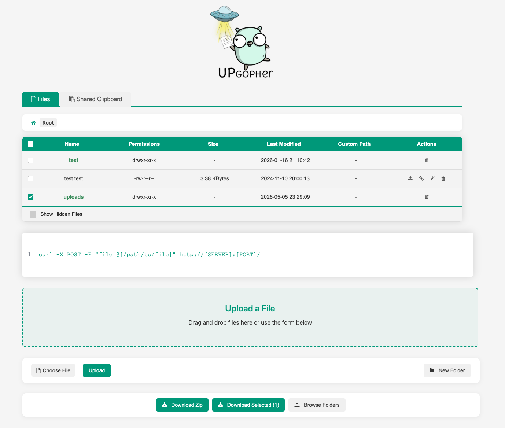
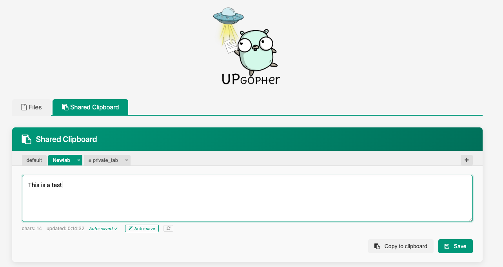
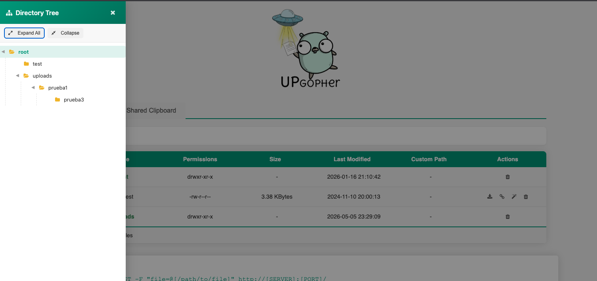

# Upgopher

<p align="center"></p>

[](https://github.com/wanetty/upgopher/actions/workflows/go.yml)

Upgopher is a zero-dependency Go web server for file sharing. It provides a browser-based interface for uploading, downloading, and managing files, with optional HTTPS, basic authentication, and read-only mode. Distributed as a single self-contained binary with no external runtime dependencies.





## Features
* Users can upload files by selecting a file and clicking the "Upload" button
* Uploaded files are stored in the "uploads" directory by default, but the directory can be changed using the -dir flag
* Users can view a list of the uploaded files by visiting the root URL
* Basic authentication is available to restrict access to the server. To use it, set the -user and -pass flags with the desired username and password.
* Traffic via HTTPS with self-signed certificate generation or custom certificates
* Browse through folders and upload files with drag-and-drop support
* Directory tree sidebar with expand/collapse controls
* Breadcrumb navigation with clickable path segments
* Copy file URLs to clipboard with one click for easy sharing
* Search within text files directly from the web interface
* Create custom path aliases for easy file access
* Shared clipboard for cross-device text and screenshot sharing
* Zip folder download functionality
* Option to hide hidden files with the -disable-hidden-files flag
* Readonly mode to disable uploads and deletions while allowing downloads


## Installation


### Automatically

Just run this command in your terminal with go installed.
```bash
go install github.com/wanetty/upgopher@latest
```

### Releases

Go to the [releases](https://github.com/wanetty/upgopher/releases) section and get the one you need.

### Manual

Just build it yourself

```bash
git clone https://github.com/wanetty/upgopher.git
cd upgopher
go build 
```
### Docker

```bash
docker build . -t upgopher
docker run --name upgopher -p 9090:9090  upgopher
```

## Usage

### Help Output:

```bash
./upgopher -h
Usage of ./upgopher:
  -cert string
        HTTPS certificate
  -dir string
        directory path (default "./uploads")
  -disable-hidden-files
        disable showing hidden files
  -key string
        private key for HTTPS
  -max-upload-size int
        maximum upload size in GB (0 means unlimited)
  -max-tabs int
        maximum number of shared clipboard tabs
  -pass string
        password for authentication
  -port int
        port number (default 9090)
  -q    quiet mode
  -read-timeout duration
        server read timeout (0 means unlimited)
  -read-header-timeout duration
        server read header timeout
  -write-timeout duration
        server write timeout (0 means unlimited)
  -readonly
        readonly mode (disable upload and delete operations)
  -ssl
        use HTTPS on port 443 by default. (If you don't put cert and key, it will generate a self-signed certificate)
  -user string
```

### Examples

**Basic usage:**
```bash
./upgopher
```
This will start the server on the default port (9090) and store uploaded files in the ./uploads directory.

**Custom port and directory:**
```bash
./upgopher -port 8080 -dir "/path/to/files"
```

**With basic authentication:**
```bash
./upgopher -user admin -pass secretpassword
```

**With HTTPS (self-signed certificate):**
```bash
./upgopher -ssl
```

**With HTTPS (custom certificate):**
```bash
./upgopher -ssl -cert /path/to/cert.pem -key /path/to/key.pem
```

**Hide hidden files:**
```bash
./upgopher -disable-hidden-files
```

**Readonly mode (disable uploads and deletions):**
```bash
./upgopher -readonly
```

**Limit upload size to 1 GB:**
```bash
./upgopher -max-upload-size 1
```

**Limit shared clipboard tabs to 5:**
```bash
./upgopher -max-tabs 5
```

**Set a custom read timeout (for large uploads on slower links):**
```bash
./upgopher -read-timeout 30m
```

**Recommended for large uploads:**
```bash
./upgopher -read-timeout 0 -write-timeout 0
```

Note: Cloudflare Quick Tunnels are intended for testing and can impose limits. For reliable large uploads, prefer a full Cloudflare Tunnel.


## Security

### Reporting Vulnerabilities

If you discover a security vulnerability, please contact [@gm_eduard](https://twitter.com/gm_eduard/) directly. Please do not open a public issue.


## License
This project is licensed under the MIT License. See the LICENSE file for details.

## Development

### Building from Source

```bash
git clone https://github.com/wanetty/upgopher.git
cd upgopher
go build -o upgopher
```

### Running Tests

```bash
# All tests
go test -v ./...

# Only fast tests (skip time-based tests)
go test -v -short ./...

# With coverage
go test -cover ./...
```

### Contributing

1. Fork the repository
2. Create a feature branch (`git checkout -b feature/amazing-feature`)
3. Make your changes
4. Run tests (`go test -v ./...`)
5. Commit your changes (`git commit -m 'Add amazing feature'`)
6. Push to the branch (`git push origin feature/amazing-feature`)
7. Open a Pull Request
